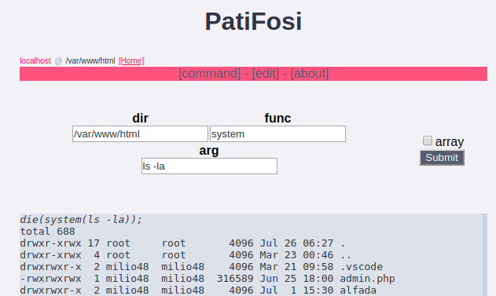

  
## example

### info gathering
- phpinfo(123)
- 
- php_uname()
- 
- disk_total_space(/)
- disk_free_space(/)
-  other

### cmd
- system(ls -la)
- 
- passthru(ls -la)
- exec(ls -la)
- shell_exec()

### list dir
- scandir(.) *[array]*
- 
- system(ls -la)
- glob(*) *[array]*
- 
- **print all php file** glob(*.php) *[array]*
- 

### open file
- file_get_contents(file.php)
- 
- 
- readfile(file.php) *[ob]*
- 
- system(cat file.php) / system(type file.php) *[windows]*
- highlight_file(file.php) / show_source(file.php)
- 
- php_strip_whitespace(file.php)
- file(file.php) *[array]*

### file handling
- **delete file** unlink(file.php)
- **handling from command** system(mv file.php to_file.php)
- **make dir** mkdir(newfolder)
- **delete dir** rmdir(foldername)
-  **touch** touch(file.php)

###  other
- function_exist(exec)
- is_writeable(.)
- is_dir(file)
- is_file(file)
